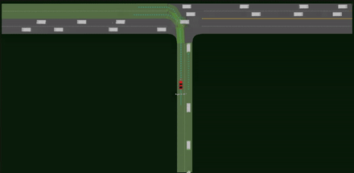

# Expert-Prior-RL

This repo is the implementation of the paper "Efficient Deep Reinforcement Learning with Imitative Expert Priors for Autonomous Driving".

[**Efficient Deep Reinforcement Learning with Imitative Expert Priors for Autonomous Driving**](https://arxiv.org/abs/2103.10690) 
> Zhiyu Huang, Jingda Wu, Chen Lv

## Getting started
1. Install the [SMARTS](https://github.com/huawei-noah/SMARTS) simulator. Follow the instructions of the official repo.

2. Install tensorflow-probability, cpprb, and seaborn
```shell
pip install tensorflow-gpu==2.3.0 tensorflow-probability==0.11.1 cpprb seaborn==0.11.0
```
   
3. Start Envision and run expert_recoding.py to demonstrate how to drive, and you need to specify the scenario to run. The available scenarios are left_turn and roundabout.
```shell
scl run --envision expert_recording.py left_turn 
```

4. Run imitation_learning_uncertainty.py to learn the imitative expert policies. You need to specify the file path to the recorded expert trajectories. You can optionally specify how many samples you would like to use to train the expert policies.
```shell
python imitation_learning_uncertainty.py expert_data/left_turn --samples 30
```

5. Run train.py to train the RL agent. You need to specify the algorithm and scenario to run, and also the file path to the pre-trained imitative models if you are using the expert prior-guided algorithms. The available algorithms are sac, expert_penalty, expert_constraint, ppo, gail. If you are using GAIL, the prior should be the path to your demonstration trajectories.
```shell
python train.py expert_penalty left_turn --prior expert_model/left_turn 
```

6. Run plot_results.py to visualize the training results. You need to specify the algorithm and scenario that you have trained with, as well as the metric you want to see (success or reward).
```shell
python plot_results.py sac left_turn success
```

7. Run test.py to test the trained policy in the testing situations. You need to specify the algorithm and scenario, and the file path to your trained model. You can start Envision to visualize the testing process at the same time.
```shell
scl run --envision test.py sac roundabout train_results/roundabout/sac/Model/Model_328_3.3651.h5
```

## Results
### Roundabout
| Algorithms | Results |
|:---:|:---:|
| Expert Prior |  |
| SAC |  |
| PPO |  |
| GAIL |  |

### Left turn
| Algorithms | Results |
|:---:|:---:|
| Expert Prior (Aggressive) |  |
| Expert Prior (Conservative) |  |
| SAC |  |
| PPO |  |
| GAIL|  |

## Reference
If you find this repo to be useful in your research, please consider citing our work
```
@article{huang2021efficient,
  title={Efficient Deep Reinforcement Learning with Imitative Expert Priors for Autonomous Driving},
  author={Huang, Zhiyu and Wu, Jingda and Lv, Chen},
  journal={arXiv preprint arXiv:2103.10690},
  year={2021}
}
```

## License
This repo is released under the MIT License. The RL algorithms are implemented based on [tf2rl](https://github.com/keiohta/tf2rl).
