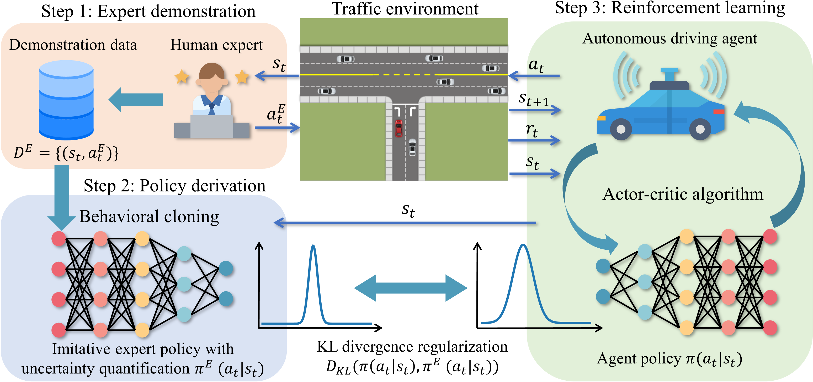

# Efficient Deep Reinforcement Learning with Imitative Expert Priors for Autonomous Driving

[Zhiyu Huang](https://scholar.google.com/citations?user=aLZEVCsAAAAJ&hl=en), [Jingda Wu](https://scholar.google.com/citations?user=icu-ZFAAAAAJ&hl=en), [Chen Lv](https://scholar.google.com/citations?user=UKVs2CEAAAAJ&hl=en) 

[AutoMan Research Lab, Nanyang Technological University](https://lvchen.wixsite.com/automan)

## Abstract

Deep reinforcement learning (DRL) is a promising way to achieve human-like autonomous driving. However, the low sample efficiency and difficulty of designing reward functions for DRL would hinder its applications in practice. In light of this, this paper proposes a novel framework to incorporate human prior knowledge in DRL, in order to improve the sample efficiency and save the effort of designing sophisticated reward functions. Our framework consists of three ingredients, namely expert demonstration, policy derivation, and reinforcement learning. In the expert demonstration step, a human expert demonstrates their execution of the task, and their behaviors are stored as state-action pairs. In the policy derivation step, the imitative expert policy is derived using behavioral cloning and uncertainty estimation relying on the demonstration data. In the reinforcement learning step, the imitative expert policy is utilized to guide the learning of the DRL agent by regularizing the KL divergence between the DRL agent's policy and the imitative expert policy. To validate the proposed method in autonomous driving applications, two simulated urban driving scenarios (unprotected left turn and roundabout) are designed. The strengths of our proposed method are manifested by the training results as our method can not only achieve the best performance but also significantly improve the sample efficiency in comparison with the baseline algorithms (particularly 60% improvement compared to soft actor-critic). In testing conditions, the agent trained by our method obtains the highest success rate and shows diverse and human-like driving behaviors as demonstrated by the human expert.

## Method Overview

Our method consists of three key steps: expert demonstration, policy derivation, and reinforcement learning. First of all, we distill the human prior knowledge through their demonstrations into the form of imitative expert policy using imitation learning and uncertainty estimation. The imitative expert policy assumes the action distribution the human expert would execute in the state, and it can be queried with a state encountered by the RL agent during training and responds with the reference action distribution. Subsequently, the imitative expert policy is used to guide the learning process of RL agents by adding the Kullback–Leibler (KL) divergence regularization between the imitative expert priors and agent policy into the RL framework.



## Results

### Unprotected left turn

| Tables        | Are   |
| --------------|:--------------:|
| <video muted controls width="99%"> <source src="./src/Left turn.mp4"  type="video/mp4"> </video> | <video muted controls width="99%"> <source src="./src/Left turn.mp4"  type="video/mp4"> </video> |
| Tables        | Are   |
| <video muted controls width="99%"> <source src="./src/Left turn.mp4"  type="video/mp4"> </video> | <video muted controls width="99%"> <source src="./src/Left turn.mp4"  type="video/mp4"> </video> |

### Roundabout

| Tables        | Are   |
| --------------|:--------------:|
| <video muted controls width="100%"> <source src="./src/Roundabout.mp4"  type="video/mp4"> </video> | <video muted controls width="100%"> <source src="./src/Roundabout.mp4"  type="video/mp4"> </video> | 

There must be at least 3 dashes separating each header cell. The outer pipes (|) are optional, and you don't need to make the raw Markdown line up prettily. You can also use inline Markdown.

| Tables        | Are   |
| --------------|:--------------:|
| <video muted controls width="100%"> <source src="./src/Roundabout.mp4"  type="video/mp4"> </video> | <video muted controls width="100%"> <source src="./src/Roundabout.mp4"  type="video/mp4"> </video> |

## Citation

```
@article{huang2021efficient,
  title={Efficient Deep Reinforcement Learning with Imitative Expert Priors for Autonomous Driving},
  author={Huang, Zhiyu and Wu, Jingda and Lv, Chen},
  journal={arXiv preprint arXiv:2103.10690},
  year={2021}
}
```

## Contact

If you have any questions, feel free to contact us (zhiyu001@e.ntu.edu.sg).
